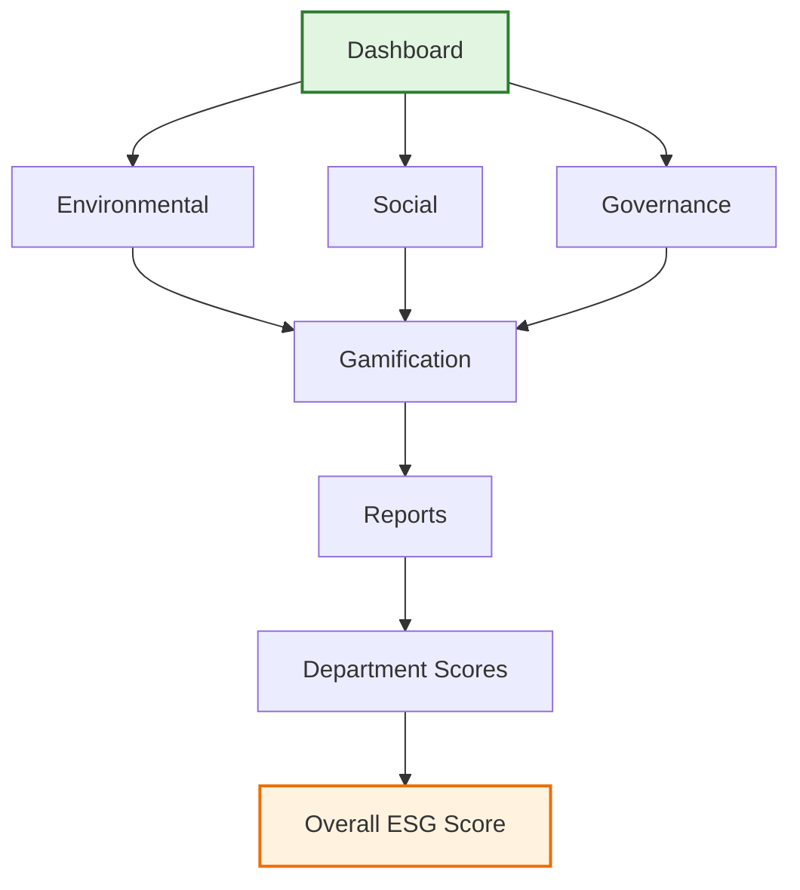

<div align="center">

# EcoSphere

### Transforming Enterprise Sustainability through Intelligent ESG Management

[]()
[]()
[]()

</div>

---

A centralized enterprise platform that enables organizations to monitor, manage, and improve their Environmental, Social, and Governance (ESG) performance through integrated dashboards, intelligent analytics, and cross-departmental collaboration tools.

> **Project Status**: EcoSphere is currently under active development. Core modules are functional; backend integration, authentication, and deployment pipelines are in progress.

---

## Table of Contents

- [About](#about)
- [Vision](#vision)
- [Why EcoSphere](#why-ecosphere)
- [Features](#features)
- [Screenshots](#screenshots)
- [Architecture](#architecture)
- [Technology Stack](#technology-stack)
- [Project Structure](#project-structure)
- [Roadmap](#roadmap)
- [UI Redesign](#ui-redesign)
- [Future Scope](#future-scope)
- [Contributing](#contributing)
- [License](#license)
- [Authors](#authors)

---

## About

**EcoSphere** is an enterprise-grade ESG Management Platform built around an official ESG ecosystem problem statement. The platform provides organizations with a centralized environment where every department contributes toward sustainability goals — transforming ESG reporting from isolated spreadsheets into integrated, everyday business operations.

The original architecture and workflows follow the intended ESG business ecosystem, while the implementation extends it with an intuitive user interface, enhanced user experience, gamification, analytics, and modern enterprise dashboard design.

---

## Vision

To make sustainability management as intuitive as managing revenue. EcoSphere envisions a world where ESG performance is not an afterthought but a core operational metric — tracked, improved, and celebrated across every level of an organization.

---

## Why EcoSphere

| Challenge | EcoSphere Solution |
|-----------|-------------------|
| ESG data scattered across spreadsheets | Unified dashboard with real-time metrics |
| Siloed department reporting | Cross-department ESG scoring and ranking |
| Low employee engagement in sustainability | Gamification with XP, badges, and leaderboards |
| Manual compliance tracking | Automated governance and compliance workflows |
| Outdated interfaces | Modern, responsive, accessible UI |

---

## Features

### Environmental

| Feature | Description | Status |
|---------|-------------|--------|
| Carbon Tracking | Monitor organizational carbon footprint in real-time | Implemented |
| Carbon Emissions | Track emission trends with historical data | Implemented |
| Sustainability Goals | Set and measure environmental KPIs | Implemented |
| Emission Factors | Configure custom emission calculation factors | Implemented |
| Environmental Dashboard | Visualize environmental performance metrics | Implemented |
| Environmental Reports | Generate detailed environmental summaries | Implemented |

### Social

| Feature | Description | Status |
|---------|-------------|--------|
| CSR Activities | Log and track corporate social responsibility initiatives | Implemented |
| Employee Participation | Measure workforce engagement in social programs | Implemented |
| Diversity Metrics | Track diversity and inclusion indicators | Implemented |
| Training Completion | Monitor ESG training progress across teams | Implemented |
| Social Dashboard | Visualize social impact metrics | Implemented |
| Employee Engagement | Drive participation through gamified challenges | Implemented |

### Governance

| Feature | Description | Status |
|---------|-------------|--------|
| ESG Policies | Centralized policy management and distribution | Implemented |
| Compliance Tracking | Monitor regulatory compliance status | Implemented |
| Audits | Schedule and manage internal and external audits | Implemented |
| Governance Reports | Generate compliance and audit summaries | Implemented |
| Compliance Issues | Track and resolve governance violations | Implemented |

### Gamification

| Feature | Description | Status |
|---------|-------------|--------|
| XP System | Earn experience points for ESG activities | Implemented |
| Badges | Unlock achievement badges for milestones | Implemented |
| Challenges | Participate in sustainability challenges | Implemented |
| Rewards | Redeem points for organizational rewards | Implemented |
| Leaderboards | Compete across departments and individuals | Implemented |

### Departments

| Feature | Description | Status |
|---------|-------------|--------|
| ESG Score per Department | Calculate department-level sustainability scores | Implemented |
| Department Ranking | Compare performance across organizational units | Implemented |
| Department Analytics | Deep-dive into department-specific metrics | Implemented |

### Reports

| Feature | Description | Status |
|---------|-------------|--------|
| Environmental Reports | Export environmental performance summaries | Implemented |
| Social Reports | Export social impact documentation | Implemented |
| Governance Reports | Export compliance and audit records | Implemented |
| ESG Summary | Consolidated ESG performance overview | Implemented |
| Custom Report Builder | Build tailored reports with drag-and-drop | Implemented |
| PDF Export | Professional PDF report generation | Implemented |
| Excel Export | Spreadsheet-compatible data exports | Implemented |

### Settings

| Feature | Description | Status |
|---------|-------------|--------|
| Organization Configuration | Manage company profile and structure | Implemented |
| ESG Configuration | Customize ESG metrics and thresholds | Implemented |
| Notification Settings | Configure alerts and reminders | Implemented |

---

## Screenshots

> The following sections contain placeholder locations for project screenshots. Replace each placeholder with the corresponding image when available.

### Hero Banner

> Insert a full-width screenshot showcasing the EcoSphere landing page with the hero section, branding, and primary call-to-action.

```
[HERO BANNER PLACEHOLDER]
```

### Current Dashboard

> Insert a full-width screenshot showcasing the overall dashboard with KPI cards, ESG score, navigation sidebar, and analytics charts.

```
[CURRENT DASHBOARD PLACEHOLDER]
```

### Overview Dashboard

> Insert a screenshot of the main overview page displaying the organizational ESG summary, recent activities, and quick-action panels.

```
[OVERVIEW DASHBOARD PLACEHOLDER]
```

### Environmental Module

> Insert a screenshot of the Environmental module showing carbon tracking charts, emission metrics, sustainability goal progress, and environmental KPI cards.

```
[ENVIRONMENTAL MODULE PLACEHOLDER]
```

### Social Module

> Insert a screenshot of the Social module displaying CSR activities, employee participation stats, diversity metrics, and training completion rates.

```
[SOCIAL MODULE PLACEHOLDER]
```

### Governance Module

> Insert a screenshot of the Governance module showing ESG policies list, compliance tracking status, audit schedules, and compliance issue tracker.

```
[GOVERNANCE MODULE PLACEHOLDER]
```

### Department Dashboard

> Insert a screenshot of the Department Dashboard showing ESG scores per department, department ranking leaderboard, and department analytics charts.

```
[DEPARTMENT DASHBOARD PLACEHOLDER]
```

### Reports

> Insert a screenshot of the Reports module displaying the report builder interface, available report templates, and export options (PDF/Excel).

```
[REPORTS MODULE PLACEHOLDER]
```

### Hive / Gamification

> Insert a screenshot of the Gamification (Hive) module showing the XP progress bar, earned badges, active challenges, rewards catalog, and leaderboards.

```
[HIVE / GAMIFICATION PLACEHOLDER]
```

### Settings

> Insert a screenshot of the Settings page showing organization configuration, ESG configuration panel, and notification preferences.

```
[SETTINGS PLACEHOLDER]
```

### Mobile View

> Insert a screenshot showcasing the responsive mobile layout of the EcoSphere dashboard on a mobile device.

```
[MOBILE VIEW PLACEHOLDER]
```

---

## Architecture



---

## Technology Stack

### Frontend

| Technology | Purpose | Status |
|------------|---------|--------|
| React | UI Framework | Implemented |
| TypeScript | Type Safety | Implemented |
| Tailwind CSS | Styling System | Implemented |
| shadcn/ui | Component Library | Implemented |
| Recharts | Data Visualization | Implemented |
| Framer Motion | Animations | In Progress |

### Backend

| Technology | Purpose | Status |
|------------|---------|--------|
| Node.js | Runtime Environment | Under Development |
| Express.js | API Framework | Under Development |
| REST API | API Architecture | Under Development |

### Database

| Technology | Purpose | Status |
|------------|---------|--------|
| PostgreSQL | Primary Database | Currently Being Finalized |
| Redis | Caching Layer | Currently Being Finalized |

### Visualization

| Technology | Purpose | Status |
|------------|---------|--------|
| Recharts | Interactive Charts | Implemented |
| Mermaid.js | Architecture Diagrams | Implemented |
| Custom SVG | Custom Visualizations | In Progress |

### Deployment

| Technology | Purpose | Status |
|------------|---------|--------|
| Docker | Containerization | Currently Being Finalized |
| CI/CD Pipeline | Automated Deployment | Currently Being Finalized |

### Tools

| Technology | Purpose | Status |
|------------|---------|--------|
| Git | Version Control | Implemented |
| GitHub | Repository Hosting | Implemented |
| Figma | UI/UX Design | Implemented |
| ESLint / Prettier | Code Quality | Implemented |
| Vite | Build Tool | Implemented |

---

## Project Structure

```
ecosphere/
├── public/
│   ├── assets/
│   └── images/
├── src/
│   ├── components/
│   │   ├── ui/              # shadcn/ui components
│   │   ├── charts/          # Recharts wrappers
│   │   ├── layout/          # Layout components
│   │   └── shared/          # Reusable components
│   ├── modules/
│   │   ├── environmental/   # Environmental module
│   │   ├── social/          # Social module
│   │   ├── governance/      # Governance module
│   │   ├── gamification/    # Gamification module
│   │   ├── departments/     # Department management
│   │   ├── reports/         # Reporting engine
│   │   └── settings/        # Configuration panels
│   ├── hooks/               # Custom React hooks
│   ├── lib/                 # Utility functions
│   ├── types/               # TypeScript definitions
│   ├── data/                # Mock data and constants
│   ├── styles/              # Global styles
│   └── pages/               # Page components
├── package.json
├── tailwind.config.ts
├── tsconfig.json
└── vite.config.ts
```

---

## Roadmap

| Phase | Milestone | Status |
|-------|-----------|--------|
| 1 | Planning and UX Research | Complete |
| 1 | Information Architecture | Complete |
| 2 | Core ESG Modules | Complete |
| 2 | Dashboard and Analytics | Complete |
| 2 | Reports Engine | Complete |
| 2 | Gamification System | Complete |
| 3 | Interactive Prototype | Complete |
| 4 | UI Redesign | In Progress |
| 4 | Backend Integration | In Progress |
| 5 | Authentication and Authorization | Planned |
| 5 | Database Implementation | Planned |
| 6 | Testing and QA | Planned |
| 6 | Production Deployment | Planned |

---

## UI Redesign

> The images below represent the design direction of the final interface. The redesign is currently in progress and the production UI will closely resemble the following concept designs.

### Upcoming UI Preview

> Insert a full-width screenshot showcasing the redesigned dashboard concept with the new premium design system, improved data visualization, modern card layouts, and enhanced navigation.

```
[UPCOMING UI PREVIEW PLACEHOLDER]
```

### What's Changing

The complete UI redesign introduces:

- **Better UX** — Streamlined workflows and reduced cognitive load
- **Premium Design System** — Consistent, polished visual language
- **Better Data Visualization** — Richer, more insightful charts and graphs
- **Responsive Layout** — Seamless experience across all devices
- **Better Accessibility** — WCAG-compliant interactions and navigation
- **Modern Dashboard** — Redesigned with enterprise-grade aesthetics
- **Improved Navigation** — Intuitive wayfinding and information hierarchy
- **Better Animations** — Smooth, purposeful micro-interactions
- **Consistent Components** — Unified component library across all modules

---

## Future Scope

<details>
<summary>Click to expand future enhancements</summary>

- **AI-Powered Insights** — Predictive analytics for ESG trend forecasting
- **Third-Party Integrations** — Connect with carbon accounting tools, HR systems, and compliance platforms
- **Multi-Tenant Support** — Manage multiple organizations from a single instance
- **Native Mobile App** — iOS and Android companion applications
- **Real-Time Alerts** — Intelligent notifications for compliance risks and goal milestones
- **Carbon Offset Marketplace** — Integrate carbon credit purchasing directly within the platform
- **Benchmarking** — Compare ESG performance against industry standards
- **ESG Training Hub** — Built-in learning management for sustainability education

</details>

---

## Contributing

We welcome contributions from the community. EcoSphere is an open-source project, and we believe great software is built collaboratively.

### How to Contribute

1. Fork the repository
2. Create a feature branch (`git checkout -b feature/amazing-feature`)
3. Commit your changes (`git commit -m 'Add amazing feature'`)
4. Push to the branch (`git push origin feature/amazing-feature`)
5. Open a Pull Request

### Development Setup

```bash
# Clone the repository
git clone https://github.com/your-org/ecosphere.git

# Navigate to project
cd ecosphere

# Install dependencies
npm install

# Start development server
npm run dev
```

### Code of Conduct

Please read our [Code of Conduct](CODE_OF_CONDUCT.md) before contributing. We are committed to providing a welcoming and inclusive experience for everyone.

---

## License

This project is licensed under the **MIT License**.

```
MIT License

Copyright (c) 2026 EcoSphere Contributors

Permission is hereby granted, free of charge, to any person obtaining a copy
of this software and associated documentation files (the "Software"), to deal
in the Software without restriction, including without limitation the rights
to use, copy, modify, merge, publish, distribute, sublicense, and/or sell
copies of the Software, and to permit persons to whom the Software is
furnished to do so, subject to the following conditions:

The above copyright notice and this permission notice shall be included in all
copies or substantial portions of the Software.

THE SOFTWARE IS PROVIDED "AS IS", WITHOUT WARRANTY OF ANY KIND, EXPRESS OR
IMPLIED, INCLUDING BUT NOT LIMITED TO THE WARRANTIES OF MERCHANTABILITY,
FITNESS FOR A PARTICULAR PURPOSE AND NONINFRINGEMENT. IN NO EVENT SHALL THE
AUTHORS OR COPYRIGHT HOLDERS BE LIABLE FOR ANY CLAIM, DAMAGES OR OTHER
LIABILITY, WHETHER IN AN ACTION OF CONTRACT, TORT OR OTHERWISE, ARISING FROM,
OUT OF OR IN CONNECTION WITH THE SOFTWARE OR THE USE OR OTHER DEALINGS IN THE
SOFTWARE.
```

---

## Authors

> Insert team member photos, names, roles, and GitHub profile links here.

| Name | Role | GitHub |
|------|------|--------|
| [Author Name] | [Role/Position] | [@username](https://github.com/username) |
| [Author Name] | [Role/Position] | [@username](https://github.com/username) |
| [Author Name] | [Role/Position] | [@username](https://github.com/username) |

---

<div align="center">

**[Back to Top](#ecosphere)**

</div>
